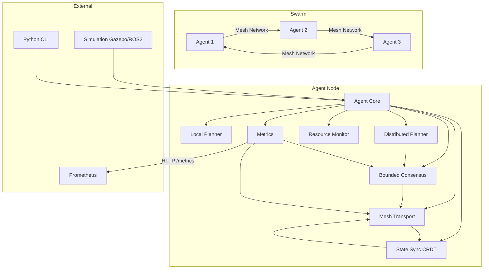

# Architecture Overview

## Vision
Offline-First Multi-Agent Autonomy SDK enables a group of robots to operate collaboratively without a central server, using local state machines, conflict‑free replicated data types (CRDTs) for state synchronization, opportunistic mesh networking, and bounded consensus.

## Core Principles
1. **Offline‑first** – Every agent remains fully functional when disconnected.
2. **Decentralized** – No single point of failure; peer‑to‑peer communication.
3. **Eventually consistent** – State converges across the swarm via CRDTs.
4. **Resource‑aware** – Agents monitor and adapt to local constraints (CPU, battery, bandwidth).
5. **Pluggable transport** – Support for various network layers (Wi‑Fi, Bluetooth, LoRa, etc.).
6. **Bounded consensus** – Guaranteed agreement within a finite number of rounds, suitable for partially synchronous networks.
7. **Observability** – Built‑in metrics and health monitoring via Prometheus.

## High‑Level Architecture

## Component Responsibilities

### 1. Mesh Transport
- **Purpose**: Reliable, unordered, peer‑to‑peer message passing over ad‑hoc networks.
- **Features**:
  - Discovery (mDNS, manual peer list)
  - Connection management (TCP, WebRTC, QUIC)
  - Message routing (flooding, greedy perimeter)
  - Quality‑of‑Service (priority, retransmission)
  - End‑to‑end encryption and authentication (Ed25519 signatures)
- **Technology**: Rust crate built on `libp2p` with an in‑memory backend for testing.

### 2. State Sync (CRDT)
- **Purpose**: Maintain a shared, eventually‑consistent key‑value store across agents.
- **Features**:
  - CRDT‑based map (`aw‑map`, `lseq‑tree`)
  - Conflict‑free merge of concurrent updates
  - Tombstone‑free garbage collection
  - Version vectors / dotted version vectors
  - Delta compression and batching
- **Technology**: Rust crate leveraging `crdts` library with custom serialization.

### 3. Local Planner
- **Purpose**: Execute autonomous tasks based on local state and shared swarm intent.
- **Features**:
  - Finite‑state machine (FSM) definition and execution
  - Task scheduling and interruption
  - Integration with ROS2 navigation stack
- **Technology**: Rust crate with `behavior‑tree` or `smach`‑like DSL.

### 4. Distributed Planner
- **Purpose**: Coordinate task assignment across multiple agents using consensus.
- **Features**:
  - Task definition and resource requirements
  - Assignment proposals via bounded consensus
  - Conflict resolution and load balancing
  - Integration with Local Planner for execution
- **Technology**: Rust crate built on top of `bounded‑consensus` and `state‑sync`.

### 5. Bounded Consensus
- **Purpose**: Reach agreement on a value within a bounded number of communication rounds.
- **Features**:
  - Two‑phase commit (simple)
  - Paxos (multi‑round, fault‑tolerant)
  - Configurable timeouts and participant sets
  - Integration with mesh transport for message passing
- **Technology**: Rust crate with pluggable consensus algorithms.

### 6. Resource Monitor
- **Purpose**: Observe local hardware constraints and adjust agent behavior.
- **Metrics**: CPU usage, battery level, network latency, memory pressure.
- **Actions**: Throttle planning frequency, reduce communication rate, switch to low‑power mode.

### 7. Agent Core
- **Purpose**: Glue component that orchestrates the above modules.
- **Lifecycle**: Initialization, event loop, graceful shutdown.
- **API**: Exposes a unified Rust trait and Python binding.

### 8. Metrics & Observability
- **Purpose**: Expose internal metrics for monitoring and debugging.
- **Features**:
  - Prometheus counters, gauges, histograms
  - HTTP endpoint `/metrics` on configurable port
  - Metrics for messages sent/received, connected peers, CRDT map size, consensus rounds, etc.
- **Technology**: `prometheus` Rust crate with `warp` HTTP server.

## Data Flow
1. Agent starts, joins mesh network via Transport.
2. Agent subscribes to shared CRDT keys (e.g., `swarm/goal`).
3. Local Planner reads local CRDT copy and decides next action.
4. Actions may update CRDT (e.g., `agent/status = moving`).
5. Transport propagates CRDT deltas to neighbors.
6. Resource Monitor may throttle outgoing messages if battery low.
7. On network partition, each agent continues with its last known state; merge occurs when connectivity resumes.
8. For coordinated tasks, Distributed Planner proposes assignments via Bounded Consensus; once decided, assignments are written to CRDT map and executed by Local Planners.
9. Metrics are continuously collected and exposed via HTTP.

## Development Roadmap

### Phase 1 – Foundation (Completed)
- Mesh Transport (basic peer discovery + messaging)
- State Sync (single‑type CRDT map)
- Integration test with two nodes

### Phase 2 – Autonomy (Completed)
- Local Planner FSM
- Resource Monitor skeleton
- Python bindings for all components
- Bounded Consensus (Two‑phase commit, Paxos)
- Metrics with Prometheus

### Phase 3 – Realism (In Progress)
- ROS2 integration (example nodes and launch files)
- Gazebo simulation with multiple robots
- Performance benchmarking and optimization
- Distributed Planner (task coordination)

### Phase 4 – Production
- CI/CD, packaging (Debian, PyPI, crates.io)
- Comprehensive documentation
- Security audit
- Fault‑injection and chaos testing

## Technology Stack
- **Language**: Rust (core), Python (bindings & high‑level API)
- **Networking**: `libp2p‑rust` with TCP/mDNS/WebSocket, in‑memory backend for tests
- **CRDT**: `crdts` library with custom serialization
- **Consensus**: Custom Paxos and two‑phase commit implementations
- **Metrics**: `prometheus` + `warp`
- **Simulation**: ROS2 Humble, Gazebo Classic / Ignition
- **Build**: Cargo workspace, `pyo3`, `maturin`
- **CI**: GitHub Actions, `cargo‑test`, `pytest`

## Directory Layout
See `README.md` for the exact folder structure.

## Contributing
Please read `CONTRIBUTING.md` (to be created) for guidelines on code style, testing, and pull requests.

---
*Last updated: 2026‑03‑27*